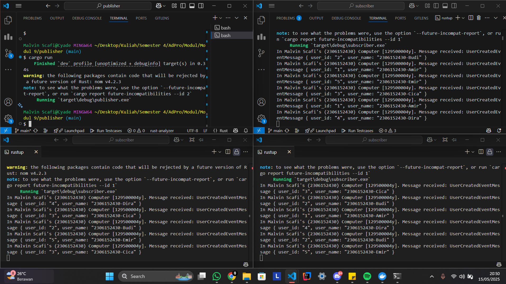
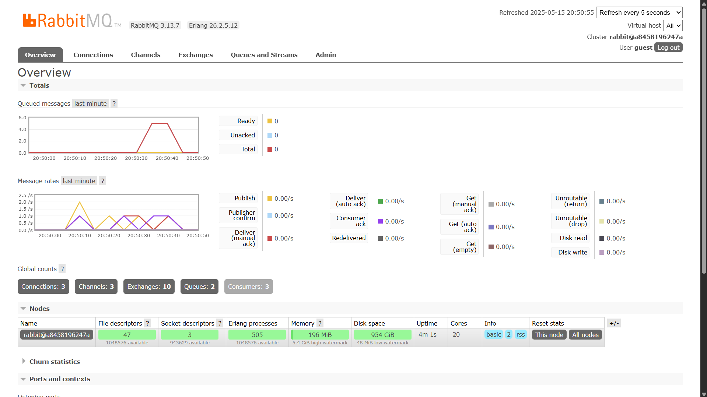
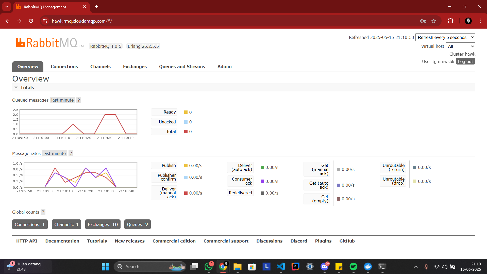

# Tutorial 9
**Nama:**   Malvin Scafi 
**NPM:**    2306152430 
**Kelas:**  Adpro A 

## Modul 9
### Reflection 1

1. What is ***amqp***?  
   AMQP (Advanced Message Queuing Protocol) adalah protokol standar terbuka untuk message-oriented middleware. Protokol ini dirancang untuk memungkinkan sistem yang berbeda berkomunikasi melalui pesan dengan cara yang andal dan terukur. AMQP sering digunakan dalam sistem antrian pesan seperti RabbitMQ.

2. What does it mean? `guest:guest@localhost:5672`, what is the first `guest`, and what is the second `guest`, and what is `localhost:5672` is for?  
   - **`guest` pertama**: Ini adalah username untuk autentikasi ke server AMQP.  
   - **`guest` kedua**: Ini adalah password untuk username tersebut.  
   - **`localhost:5672`**:  
     - `localhost` menunjukkan bahwa server AMQP berjalan di mesin lokal (komputer Anda sendiri).  
     - `5672` adalah port default yang digunakan oleh server AMQP (seperti RabbitMQ) untuk menerima koneksi.

### Reflection 2 (Simulating slow subcriber)

- Pada grafik atas, terlihat adanya peningkatan jumlah pesan yang tersimpan di dalam queue. Hal ini disebabkan oleh *publisher* yang mengirimkan pesan lebih cepat dibandingkan kemampuan *subscriber* untuk memprosesnya. *Subscriber* sengaja diberi *delay* untuk mensimulasikan kondisi *subscriber* yang lambat. Akibatnya, pesan-pesan yang belum diproses akan ditampung sementara di dalam queue hingga *subscriber* memprosesnya satu per satu.

### Reflection 3 (Running at least 3 subscribers)

- Saat kita menjalankan beberapa *subscriber* secara bersamaan, pesan-pesan yang dikirim oleh *publisher* akan dibagikan secara merata ke masing-masing *subscriber*. Dengan pendekatan ini, proses pemrosesan pesan dapat dilakukan lebih cepat karena berlangsung secara paralel. Selain itu, message *broker* akan menjamin bahwa setiap pesan hanya dikonsumsi dan diproses oleh satu *subscriber*, sehingga tidak terjadi duplikasi dalam penanganan pesan.

- Dengan bertambahnya jumlah *subscriber*, grafik *queued messages* yang sebelumnya mengalami lonjakan dalam waktu lama kini hanya menunjukkan kenaikan singkat. *Throughput* dari *consumer* pun menjadi lebih seimbang dengan *throughput* milik *producer*. Hal ini disebabkan karena jumlah *subscriber* yang lebih banyak memungkinkan pesan dari *publisher* diproses dengan lebih cepat. Walaupun setiap *consumer* memproses pesan dengan kecepatan yang lebih lambat, kehadiran 3 *consumer instance* membantu meningkatkan kemampuan pemrosesan pesan secara keseluruhan. Dampaknya, jumlah pesan yang menumpuk dalam *queue* menurun secara signifikan.

## Modul 9 (Bonus)
### Reflection 4 (Simulating slow subscriber - Cloud)

- Sama seperti yang sebelumnya akan tetapi ada perbedaan pada instance yang digunakan yakni menggunakan *cloud* dan bukan *localhost*.